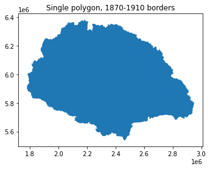
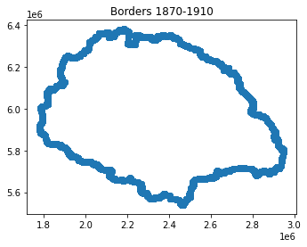
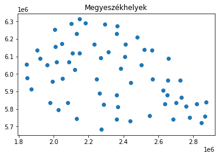
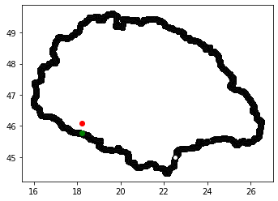

```python
import geopandas as gpd
import os
import pyproj
import matplotlib.pyplot as plt
from shapely.geometry import MultiPoint
from shapely.ops import cascaded_union, nearest_points
```

# Compute the distance between Hungarian cities and the closest point on the historical Hungarian border

## 0. Data 

Data source: [GISta](https://www.gistory.hu/g/hu/gistory/otka#2_Let%C3%B6lthet%C5%91%20anyagok)

We need 2 datasets:  
        1. the point coordinates of the border   
        2. the coordinates of the cities  
    
(1) has to be created from county-level maps.

## 1. Recreate the border from county-level (járás) maps


```python
jaras = gpd.read_file("data/MO_Jaras.dbf")
```

### Original polygons (jaras szintu)


```python
jaras.plot()
plt.title('Járások, 1870-1910 borders')
```


    Text(0.5, 1.0, 'Járások, 1870-1910 borders')


### Create a single polygon


```python
polygons = jaras.geometry.values
border = gpd.GeoSeries(cascaded_union(polygons))
```


```python
border.plot()
plt.title('Single polygon, 1870-1910 borders')
```





### Create a list of points from the polygon


```python
border_points = border.copy()
border_points = border_points.geometry.apply(lambda x: MultiPoint(list(x.exterior.coords)))
```


```python
border_points.plot()
plt.title('Borders 1870-1910')
```


    Text(0.5, 1.0, 'Borders 1870-1910')





## 2. Bring in the city-level data!


```python
telepules = gpd.read_file("data/MO_Telepules.shp")
```

Originally, cities are polygons (below you can see Pécs), we want to get the central point so we can compute the distance


```python
telepules.iloc[0].geometry
```


The next cell computes the centorid for each city. After this operation, we'll have a single point per city.


```python
telepules['centers'] = telepules['geometry'].centroid
```


```python
telepules[telepules.MegyeSzekh == 'T'].centers.plot()
plt.title('Megyeszékhelyek')
```


    Text(0.5, 1.0, 'Megyeszékhelyek')





## 3. Find nearest points


```python
def get_distance(a,b):
    """function computing the distance (km) between 2 pairs of coordinates"""
    a_x, a_y = a.x, a.y
    b_x, b_y = b.x, b.y
    geod = pyproj.Geod(ellps='WGS84')
    angle1,angle2,distance = geod.inv(a_x,a_y,b_x,b_y)
    return distance/1000
```


```python
# first, we find the nearest point on the border
telepules['nearest'] = telepules.apply(lambda row: nearest_points(row.centers, border_points[0])[1], axis=1)

# next, we project the points from Web Mercator / Pseudo Mercator ("EPSG:3857") to WGS84 (World Geodetic System 1984, EPSG:4326, this one is used in the GPSs
telepules['nearest'] = gpd.GeoDataFrame(telepules[['nearest']], geometry='nearest').set_crs("EPSG:3857").to_crs("EPSG:4326")
telepules['centers'] =  gpd.GeoDataFrame(telepules[['centers']], geometry='centers').set_crs("EPSG:3857").to_crs("EPSG:4326")

# now we can easily compute the distance
telepules['distance'] = telepules.apply(lambda row: get_distance(row.centers, row.nearest), axis=1)
```


```python
telepules['nearest'][0].coords[0]
```


    (18.206553309614662, 45.78589778018612)


The distance between the cities and the borders is in the `distance` column of the dataframe.

## 4. Test the output

The function `plot_city_nearest` takes a city name as argument and displays the border with black, the location of the city with red and the nearest point on the border with green. The small map it outputs helps to check if the calculations were correct. You can also check the points on google maps to validate.


```python
def plot_city_nearest(city, border_data=border_points, cities_data=telepules, save=True):
    
    filt_df = cities_data[cities_data.telepulesn == city]
    
    print('The coordinates of the city: {}'.format(cities_data[cities_data.telepulesn == city]['centers'][0].coords[0]))
    print('The coordinates of the border point: {}'.format(cities_data[cities_data.telepulesn == city]['nearest'][0].coords[0]))
    print('The distance between {} and the border is {:0.2f} km'.format(city, cities_data[cities_data.telepulesn == city]['distance'].values[0]))
    
    ax = border_data.set_crs("EPSG:3857").to_crs("EPSG:4326").plot(
        color='white', edgecolor='black')

    gpd.GeoDataFrame(filt_df[['centers']], geometry='centers').set_crs("EPSG:4326").plot(ax=ax, color='red')

    gpd.GeoDataFrame(filt_df[['nearest']], geometry='nearest').set_crs("EPSG:4326").plot(ax=ax, color='green')

    plt.show()
    
    if save:
        plt.savefig('data/{}.png'.format(city))
```


```python
plot_city_nearest('Pécs')
```

    The coordinates of the city: (18.2217903805341, 46.08665705155916)
    The coordinates of the border point: (18.206553309614662, 45.78589778018612)
    The distance between Pécs and the border is 33.45 km





    <Figure size 432x288 with 0 Axes>


That's all, have fun!
